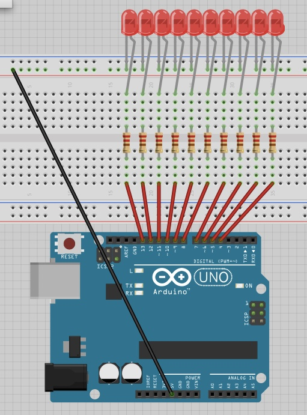

##Torrentuino

Torrentuino is a node app that pings Bittorrent's API in order to see how far along the top download is. Then, it contacts Arduino and lights up the download meter which is a set of 10 LEDs. Every LED represents 10% of the download. Whenever a block of 10% is done downloading, the corresponding LED lights up and the next block will start blinking. Once the entire torrent is over 95% downloaded, the entire LED set will start blinking. It will reset to the next download after a certain amount of time.

###Setup
Please follow the following diagram for the setup:

